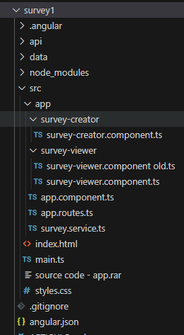
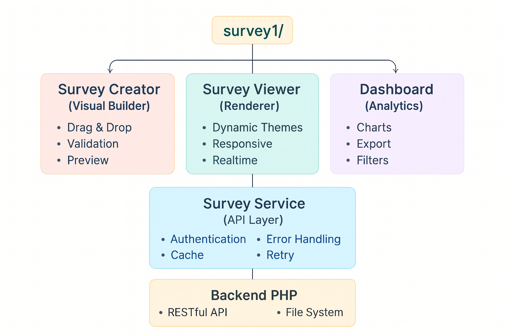
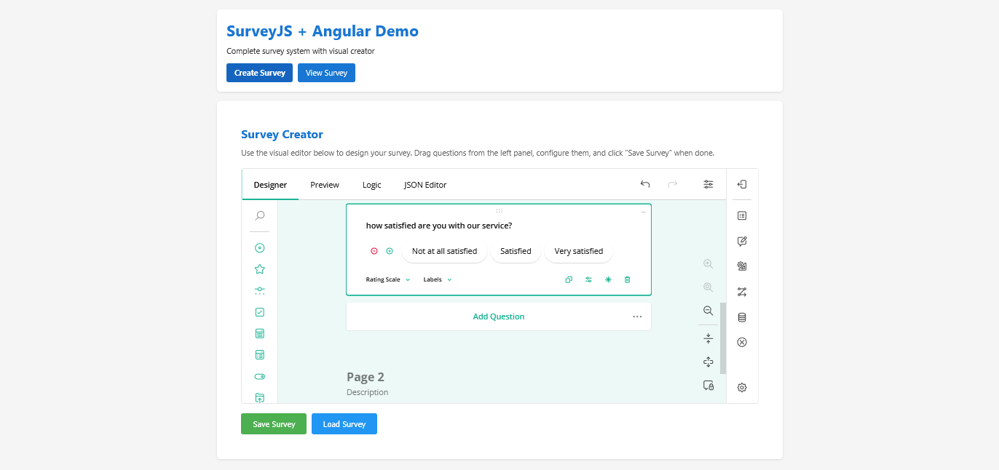
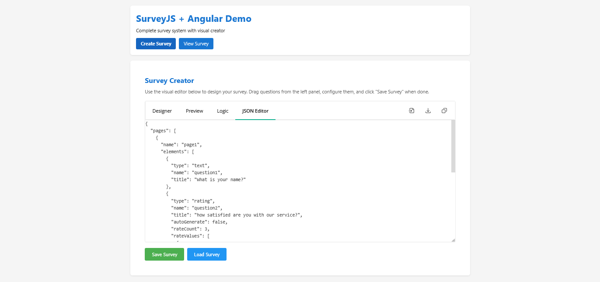
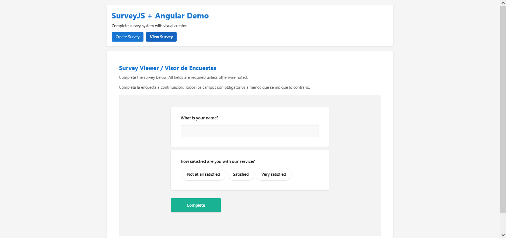

# How I Built a Form Management Platform with Angular 17 and SurveyJS: A Self-Hosted Alternative to SaaS Tools

## Limitations of SaaS Tools

SaaS survey platforms such as SurveyMonkey, Typeform, and Google Forms have made survey creation accessible to many users. However, these tools also introduce several limitations that affect flexibility and data control. Common issues include limits on the number of responses, restricted options for interface customization, limited form styling options, reliance on third-party services for the storage of sensitive information, and increasing subscription costs that can become difficult for growing organizations to sustain.

For organizations that want to automate their data collection processes but still require full control over their data workflows, a custom form management solution provides clear advantages. A self-hosted system ensures complete ownership of data and infrastructure, unrestricted customization for different use cases, predictable operational costs without usage-based limitations, and direct integration with internal systems. When used together, Angular 17 and SurveyJS offer a reliable technology stack for building a custom form management platform that exceeds the capabilities of any commercial SaaS solution.

The architecture described here is based on three key components:

1. A modern Angular frontend that uses standalone components.
2. A visual builder by SurveyJS ([GitHub](https://github.com/surveyjs)) for creating forms and surveys.
3. A simple PHP backend responsible for data operations. Are you referring to changing something in the article?

This combination allows you to build a scalable and maintainable platform that keeps all aspects of form management fully under your control.

## Environment Setup: Technical Architecture and Dependencies

### Project Structure and Dependencies

The purpose of this article is not to provide large amounts of code, but to explain how a system of this type can be organized. The source code is available separately so that you can review it in detail while following the structural explanation.

To begin, we configure an Angular 17 project and install the necessary SurveyJS dependencies. The application architecture follows a modular structure that separates the main stages of the form management workflow:

- Form and survey construction
- Form rendering and visualization
- Survey results processing and analysis

#### Create the Angular Project

```bash
ng new survey1 --standalone --routing --style=scss
cd survey1
```

Angular 17 introduces significant improvements in standalone component management, removing the need for NgModules and simplifying the overall application architecture. This results in a cleaner and more maintainable structure.

### Install SurveyJS Packages

Install the main SurveyJS packages:

```bash
npm install survey-creator-angular survey-angular-ui
npm install @types/survey-creator --save-dev
```

### Configure the PHP Backend

Create an `api` directory and set up the PHP API:

```bash
mkdir api
cd api
```

For local development, use the built-in PHP server:

```bash
php -S localhost:8080
```

Create the necessary PHP files for your API endpoints. These files will handle survey creation, storage, and results collection.

### Complete Project Structure

To illustrate the application clearly, the following section shows how the project is organized.



 You can review the source code for a more detailed understanding of each part.Our main idea can look like this:



## Visual Interface and Interactivity of the Survey Creator Component

### SurveyCreator Implementation

The Survey Creator is the central component of the platform. It enables users to design surveys through a visual interface. Angular 17 offers the structural foundation required to integrate this component in a stable and predictable manner.

The form builder interface supports the construction of surveys through drag-and-drop actions, configuration of conditional logic, definition of validation rules, and adjustment of visual settings. SurveyJS Creator automatically produces the JSON schema that represents the structure of each form. This JSON schema becomes part of the system's form management workflow, because it is stored in the backend and later used for form automation tasks such as form rendering, updating, and survey data visualisation and analysis.





### Angular Components Configuration

With Angular 17 and its standalone components, configuration is significantly simplified:

```typescript
// src/app/survey-creator/survey-creator.component.ts
import { Component, OnInit } from '@angular/core';
import { CommonModule } from '@angular/common';
import { SurveyCreatorModel } from 'survey-creator-core';
import { SurveyCreatorModule } from 'survey-creator-angular';
import { SurveyService } from '../survey.service';

@Component({
  selector: 'app-survey-creator',
  standalone: true,
  imports: [CommonModule, SurveyCreatorModule],
  template: `
    <div class="creator-container">
      <h2>Survey Creator </h2>
      <p class="instructions">
        Use the visual editor below to design your survey. 
        Drag questions from the left panel, configure them, and click "Save Survey" when done.
      </p>
     
      
      <div class="creator-wrapper">
        <survey-creator [model]="creator"></survey-creator>
      </div>

      <div class="actions">
        <button (click)="saveSurvey()" [disabled]="saving" class="save-btn">
          {{ saving ? 'Saving... ' : 'Save Survey ' }}
        </button>
        <button (click)="loadSurvey()" [disabled]="loading" class="load-btn">
          {{ loading ? 'Loading...' : 'Load Survey ' }}
        </button>
      </div>

      <div *ngIf="message" [class]="'message ' + messageType">
        {{ message }}
      </div>
    </div>
  `,
  styles: [`
    .creator-container {
      padding: 20px;
    }

    h2 {
      color: #1976d2;
      margin-bottom: 10px;
    }

    .instructions {
      color: #666;
      margin-bottom: 15px;
      line-height: 1.6;
    }

    .creator-wrapper {
      margin: 20px 0;
      border: 1px solid #ddd;
      border-radius: 4px;
      overflow: hidden;
    }

    .actions {
      display: flex;
      gap: 10px;
      margin-top: 20px;
    }

    button {
      padding: 12px 24px;
      border: none;
      border-radius: 4px;
      cursor: pointer;
      font-size: 16px;
      transition: background-color 0.3s;
    }

    button:disabled {
      opacity: 0.6;
      cursor: not-allowed;
    }

    .save-btn {
      background-color: #4caf50;
      color: white;
    }

    .save-btn:hover:not(:disabled) {
      background-color: #45a049;
    }

    .load-btn {
      background-color: #2196f3;
      color: white;
    }

    .load-btn:hover:not(:disabled) {
      background-color: #1976d2;
    }

    .message {
      margin-top: 15px;
      padding: 12px;
      border-radius: 4px;
    }

    .message.success {
      background-color: #d4edda;
      color: #155724;
      border: 1px solid #c3e6cb;
    }

    .message.error {
      background-color: #f8d7da;
      color: #721c24;
      border: 1px solid #f5c6cb;
    }
  `]
})
export class SurveyCreatorComponent implements OnInit {
  creator!: SurveyCreatorModel;
  saving = false;
  loading = false;
  message = '';
  messageType: 'success' | 'error' = 'success';

  constructor(private surveyService: SurveyService) {}

  ngOnInit() {
    // Initialize Survey Creator
    // Inicializar el Creador de Encuestas
    this.creator = new SurveyCreatorModel({
      showLogicTab: true,
      showJSONEditorTab: true,
      showTestSurveyTab: true,
      showDesignerTab: true
    });

    // Optional: Set default JSON
    // Opcional: Establecer JSON por defecto
    this.creator.JSON = {
      pages: [
        {
          name: "page1",
          elements: [
            {
              type: "text",
              name: "question1",
              title: "What is your name?"
            }
          ]
        }
      ]
    };
  }

  /**
   * Save survey to backend
   * Guardar encuesta en el backend
   */
  saveSurvey() {
    this.saving = true;
    this.message = '';

    const surveyJson = this.creator.JSON;

    this.surveyService.saveSurvey(surveyJson).subscribe({
      next: (response) => {
        this.saving = false;
        if (response.success) {
          this.showMessage('Survey saved successfully!', 'success');
        } else {
          this.showMessage('Error saving survey', 'error');
        }
      },
      error: (error) => {
        this.saving = false;
        console.error('Error saving survey:', error);
        this.showMessage('Error: ' + (error.message || 'Failed to save'), 'error');
      }
    });
  }

  /**
   * Load survey from backend
   * Cargar encuesta desde el backend
   */
  loadSurvey() {
    this.loading = true;
    this.message = '';

    this.surveyService.loadSurvey().subscribe({
      next: (survey) => {
        this.loading = false;
        if (survey && Object.keys(survey).length > 0) {
          this.creator.JSON = survey;
          this.showMessage('Survey loaded successfully! ', 'success');
        } else {
          this.showMessage('No survey found ', 'error');
        }
      },
      error: (error) => {
        this.loading = false;
        console.error('Error loading survey:', error);
        this.showMessage('Error: ' + (error.message || 'Failed to load '), 'error');
      }
    });
  }

  private showMessage(text: string, type: 'success' | 'error') {
    this.message = text;
    this.messageType = type;
    if (type === 'success') {
      setTimeout(() => {
        this.message = '';
      }, 3000);
    }
  }
}
```

## JSON Schemas: Structure and Conditional Logic

### SurveyJS Schema Fundamentals

The JSON schema produced by SurveyJS Creator represents the full structure, content, and behavior of a survey. It contains all information about the questions, pages, and survey elements, as well as any conditional logic that determines how questions are shown or hidden based on user responses. Using this schema, it is possible to create both simple and complex surveys without writing additional code.

The following section provides an example of a JSON schema generated by SurveyJS Creator:

```json
{
  "title": "Customer Satisfaction Survey",
  "description": "Help us improve our services",
  "pages": [
    {
      "name": "page1",
      "elements": [
        {
          "type": "rating",
          "name": "question1",
          "title": "How satisfied are you with our service?",
          "autoGenerate": false,
          "rateCount": 2,
          "rateValues": [
            { "value": 1, "text": "Not at all satisfied" },
            { "value": 2, "text": "Very satisfied" }
          ],
          "rateMax": 2
        }
      ]
    }
  ]
}
```

We can also see this visually in this way:



## Rendering and User Experience

### SurveyViewer Implementation

The survey viewer is the component that displays surveys to users. It ensures that surveys are rendered in a responsive manner, adapting to different devices and screen sizes. The combination of Angular 17 and SurveyJS enables the survey viewer to perform efficiently and allows you to provide a consistent and user-friendly experience across desktops, tablets, and mobile devices.

The following section shows an example of the survey viewer displaying a loaded survey:



And this is our viewer component code:

```typescript
import { Component, OnInit } from '@angular/core';
import { CommonModule } from '@angular/common';
import { SurveyModel } from 'survey-core';
import { SurveyModule } from 'survey-angular-ui';
import { SurveyService, SurveySchema } from '../survey.service';

@Component({
  selector: 'app-survey-viewer',
  standalone: true,
  imports: [CommonModule, SurveyModule],
  template: `
    <div class="viewer-container">
      <h2>Survey Viewer / Visor de Encuestas</h2>
      <p class="instructions">
        Complete the survey below. All fields are required unless otherwise noted.
      </p>
      <p class="instructions">
        Completa la encuesta a continuación. Todos los campos son obligatorios a menos que se indique lo contrario.
      </p>

      <div *ngIf="loading" class="loading">
        Loading survey... / Cargando encuesta...
      </div>

      <div *ngIf="error" class="error-message">
        {{ error }}
      </div>

      <div *ngIf="survey && !loading" class="survey-wrapper">
        <survey [model]="survey"></survey>
      </div>

      <div *ngIf="message" [class]="'message ' + messageType">
        {{ message }}
      </div>
    </div>
  `,
  styles: [`
    .viewer-container {
      padding: 20px;
    }

    h2 {
      color: #1976d2;
      margin-bottom: 10px;
    }

    .instructions {
      color: #666;
      margin-bottom: 15px;
      line-height: 1.6;
    }

    .loading {
      text-align: center;
      padding: 40px;
      color: #666;
      font-size: 18px;
    }

    .error-message {
      padding: 15px;
      background-color: #f8d7da;
      color: #721c24;
      border: 1px solid #f5c6cb;
      border-radius: 4px;
      margin: 20px 0;
    }

    .survey-wrapper {
      margin: 20px 0;
    }

    .message {
      margin-top: 15px;
      padding: 12px;
      border-radius: 4px;
    }

    .message.success {
      background-color: #d4edda;
      color: #155724;
      border: 1px solid #c3e6cb;
    }

    .message.error {
      background-color: #f8d7da;
      color: #721c24;
      border: 1px solid #f5c6cb;
    }
  `]
})
export class SurveyViewerComponent implements OnInit {
  survey: SurveyModel | null = null;
  loading = false;
  error = '';
  message = '';
  messageType: 'success' | 'error' = 'success';

  constructor(private surveyService: SurveyService) {}

  ngOnInit() {
    this.loadSurvey();
  }

  /**
   * Load survey from backend
   * Cargar encuesta desde el backend
   */
  loadSurvey() {
    this.loading = true;
    this.error = '';
    this.message = '';

    this.surveyService.loadSurvey().subscribe({
      next: (response: any) => {
        this.loading = false;
        const surveyJson = response.survey || response;
        if (surveyJson && Object.keys(surveyJson).length > 0) {
          this.survey = new SurveyModel(surveyJson);
          this.setupSurveyCompleteHandler();
          console.log('Survey loaded:', surveyJson);
        } else {
          this.error = 'No survey found. Please create one first. / No se encontró encuesta. Por favor crea una primero.';
        }
      },
      error: (error) => {
        this.loading = false;
        console.error('Error loading survey:', error);
        this.error = 'Error loading survey. / Error al cargar encuesta.';
      }
    });
  }

  /**
   * Setup survey complete handler after survey is loaded
   * Configurar el manejador de finalización según la forma oficial de SurveyJS
   * Official docs: https://surveyjs.io/form-library/documentation/api-reference/survey-data-model#onComplete
   */
  private setupSurveyCompleteHandler() {
    if (this.survey) {
      // Forma oficial de SurveyJS según la documentación
      this.survey.onComplete.add((sender) => {
        const results = sender.data;
        console.log('Survey completed:', results);

        this.surveyService.saveResults(results).subscribe({
          next: (response) => {
            if (response.success) {
              this.showMessage('Thank you! Your responses have been saved. / ¡Gracias! Tus respuestas han sido guardadas.', 'success');
            } else {
              this.showMessage('Error saving results / Error al guardar resultados', 'error');
            }
          },
          error: (error) => {
            console.error('Error saving results:', error);
            this.showMessage('Error: ' + (error.message || 'Failed to save / Error al guardar'), 'error');
          }
        });
      });
    }
  }

  private showMessage(text: string, type: 'success' | 'error') {
    this.message = text;
    this.messageType = type;
    if (type === 'success') {
      setTimeout(() => {
        this.message = '';
      }, 5000);
    }
  }
}
```

### Themes and Visual Customization

SurveyJS provides a [theme system](https://surveyjs.io/form-library/documentation/manage-default-themes-and-styles) that allows full customization of the survey's appearance. Custom themes can be used to maintain a consistent visual identity that aligns with an organization's branding.

## Complete Integration: Workflow and Services

### Angular Services for Backend Communication

In modern web applications that interact with external data, it is important to maintain a clear separation between the user interface and backend logic. In [this form management platform](https://surveyjs.io/), the Angular service layer acts as an intermediary between the SurveyJS front-end and the PHP backend API. This separation keeps the application modular, testable, and easier to maintain.

The Angular services manage all communication with the PHP backend. They provide an abstraction layer that simplifies create, read, update, and delete (CRUD) operations, while also handling authentication if needed.

The main service in this project is `SurveyService`, located in `src/app/survey.service.ts`. This service is responsible for all client–server interactions related to surveys. Internally, it uses Angular's `HttpClient` to communicate with REST endpoints defined in the PHP backend, such as:

- `/api/load_survey.php`

- `/api/save_survey.php`

- `/api/save_results.php`

The primary responsibilities of `SurveyService` include:

- loadSurvey() – Loads the survey schema from the backend.

- saveSurvey() – Saves the survey schema by sending JSON data to `save_survey.php`.

- saveResults() – Stores user responses in `survey_results.json`.

- loadResults() – Retrieves all accumulated survey responses for analysis.

This service provides a simple and effective interface for managing all survey operations without requiring complex authentication or validation logic. It allows the front-end to interact with the backend efficiently while keeping the code modular and maintainable.

**File: src/app/survey.service.ts**

```typescript
import { Injectable } from '@angular/core';
import { HttpClient } from '@angular/common/http';
import { Observable } from 'rxjs';

export interface SurveySchema {
  pages?: any[];
  questions?: any[];
  [key: string]: any;
}

export interface SurveyResult {
  timestamp: string;
  results: any;
}

@Injectable({
  providedIn: 'root'
})
export class SurveyService {
  // API URL - Adjust if your Laragon setup uses a different path
  private apiUrl = '/api';

  constructor(private http: HttpClient) {}

  /**
   * Save survey schema to backend
   */
  saveSurvey(survey: SurveySchema): Observable<any> {
    return this.http.post(`${this.apiUrl}/save_survey.php`, { survey });
  }

  /**
   * Load survey schema from backend
   */
  loadSurvey(): Observable<SurveySchema> {
    return this.http.get<SurveySchema>(`${this.apiUrl}/load_survey.php`);
  }

  /**
   * Save survey results
   */
  saveResults(results: any): Observable<any> {
    const data: SurveyResult = {
      timestamp: new Date().toISOString(),
      results
    };
    return this.http.post(`${this.apiUrl}/save_results.php`, data);
  }

  /**
   * Load survey results
   */
  loadResults(): Observable<SurveyResult[]> {
    return this.http.get<SurveyResult[]>(`${this.apiUrl}/load_results.php`);
  }
}
```

## PHP Backend: Direct Architecture and Communication Flow

### The Backend as a Processing System

The PHP backend handles all data processing for the form management platform. It receives requests from the Angular frontend, processes them, and returns structured responses. The backend uses a direct endpoints pattern, focusing on simplicity and immediate functionality rather than a complex multi-layered architecture.

### Layer 1: Communication Interface and CORS Configuration

#### Technical Implementation

The first layer establishes HTTP communication and configures cross-origin resource sharing (CORS) policies. This layer is implemented across four main PHP files, which serve as entry points to the system:

- `api/load_survey.php` – Survey schema loading

  - Sets CORS headers for local development

  - Configures the `Content-Type` to `application/json`

  - Validates the HTTP GET method

  - Reads `survey_schema.json` from the `data/` directory

  - Checks the integrity of the JSON before returning it

- `api/save_survey.php` – Schema saving

  - Sets security and CORS headers

  - Validates the HTTP POST method

  - Processes JSON input with validation

  - Automatically creates the `data/` directory if it does not exist

  - Writes the file with readable formatting and Unicode support

### Layer 2: Error Handling and Basic Validation

#### Storage Endpoints

- `api/save_results.php` – Response storage

  - Validates the structure of incoming data

  - Reads existing results to preserve accumulated responses

  - Adds new responses with an automatic timestamp

  - Maintains existing data integrity

  - Returns the total number of submissions

- `api/load_results.php` – Results retrieval

  - Handles non-existent files by returning an empty array

  - Validates JSON integrity

  - Normalizes data into a consistent array format

  - Performs structure validation for returned data
  
### Direct Processing Flow

#### Saving a Survey Schema

Incoming request: POST `/api/save_survey.php` with survey JSON schema

#### Step-by-step flow:

1. Interface (`api/save_survey.php`)

- Parse HTTP headers and configure CORS

- Verify that the request method is POST

- Read JSON data from `php://input`

2. Validation (same file)

- Check JSON syntax

- Verify required structure (`data['survey']`)

- Ensure non-empty fields

3. Persistence (same file)

- Create `data/` directory if it does not exist

- Write `survey_schema.json` using `JSON_PRETTY_PRINT`

- Return confirmation including file information and bytes written

#### Response:

```bash
{ "success": true, "message": "...", "file": "...", "bytes_written": ... }
```

#### Saving User Responses

Incoming request: `POST /api/save_results.php` with survey responses

#### Step-by-step flow:

1. Interface (`api/save_results.php`)

- Configure HTTP headers

- Validate request method

- Process JSON input

2. Validation (same file)

- Verify required results structure

- Validate timestamp, creating one if missing

3. Accumulation (same file)

- Read existing `survey_results.json`

- Append new response

- Preserve previous responses

4. Persistence (same file)

- Write updated array to the file

- Return response including total submission count

#### Response:

```bash
{ "success": true, "message": "...", "total_submissions": ..., "bytes_written": ... }
```

## Complete Workflow and Architecture

The survey platform functions as an integrated system with the following structure:

```
Frontend Angular ←→ PHP API Endpoints ←→ JSON Files (data/)
       ↑               ↑
   SurveyJS         Direct Endpoints
Components +       survey_schema.json
SurveyService +    survey_results.json
CORS Configured
```

### Workflow Steps:

#### 1. Creation:
User designs survey → SurveyCreator → `save_survey.php` → `data/survey_schema.json`

#### 2. Visualization:
Application loads → `load_survey.php` → SurveyViewer renders survey

#### 3. Response Collection:
User completes survey → `SurveyService.saveResults()` → `save_results.php` → `data/survey_results.json`

#### 4. Analysis:
Application queries → `load_results.php` → Response array processing

## Conclusion

The combination of Angular 17 and SurveyJS provides a stable foundation for building a robust form management platform. The direct endpoint architecture demonstrates that simplicity in design does not reduce functionality.

This system handles survey creation, rendering, user responses, and result storage efficiently while remaining easy to maintain. It also overcomes the limitations of SaaS survey tools, giving organizations full control over their data and the flexibility to implement any customization to both the form builder UI and the forms.

By using a simple architecture with well-defined endpoints, the platform achieves practical functionality without unnecessary complexity.
